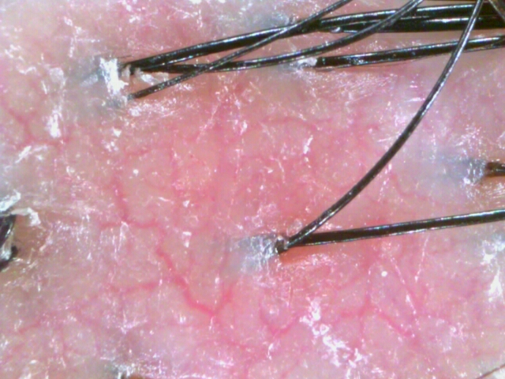

batch.py 코드 설명
=============

필요한 라이브러리
--------------
- numpy
- PIL
- os

코드 목적
--------------
1. 폴더에 있는 이미지들을 읽기
2. ImageNet에서 사용된 PCA Color Augmentation 실행
3. Augmentation 이미지를 저장

알고리즘
--------------
1. 기준 이미지에서 R, G, B 각각의 값의 평균을 계산해 평균 R, 평균 G, 평균 B 값인 s_r_m, s_g_m, s_b_m를 계산
2. 기준 이미지의 모든 RGB 값의 평균으로 광도인 s_fade를 계산 
3. 처리 이미지에도 1.와 같은 방법으로 평균 R, 평균 G, 평균 B 값인 img_r, img_b, img_c를 계산
4. 처리 이미지에도 2.와 같은 방법으로 광도 img_fade를 계산
5. 처리 이미지에 R, G, B 값에 각각 기준 이미지와 처리 이미지의 RGB 평균 값 차이 및 기준 이미지와 처리 이미지의 광도 차이 값을 더해서 처리한다.
6. 기준 이미지 평균  R값에 사용자가 지정한 퍼센트 내에서 랜덤으로 값을 선정한다.
7. 처리 이미지의 R 값을 6.의 값을 더한다.
8. 사용자가 입력한 출력 이미지의 개수만큼 3.~7.의 과정을 반복한다.

처리 결과
--------------
- 눈으로 보기에 차이가 없으나, 미세한 값의 변경이 있어 네트워크에서 그 차이를 감지할 수 있다.

| Original Image | After Augmentation |
| :-----: | :-----: |
|  |  |

코드 실행 방법
--------------

- batch.py 파일을 실행한다.
    - 분산 값을 원하는 대로 설정한다. (alpha, 기본값: 0.1)
    ```
    alpha = 0.1
    ```
    - 이미지를 읽을 파일 경로 설정 (path)
    ```
    path = 'F:/DGU/Codes/ScalpAnalysis/ScalpAnalysis/ColorPreprocessing/test_images' # path of the original dataset folder
    ```

    - Augmentation된 이미지를 저장할 경로 설정 (path3)
    ```
    path3 = "F:/DGU/Codes/ScalpAnalysis/ScalpAnalysis/pca_color_augmentation/res_images/" #path of the destination folder
    ```