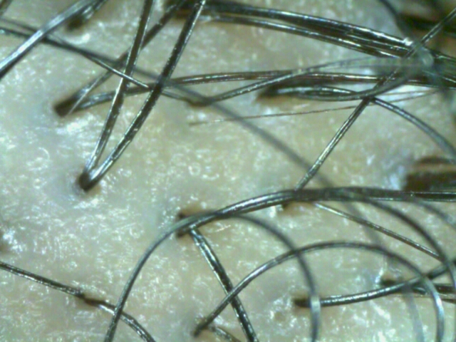

# ScalpAnalysis
2022년도 2학기 두피 분석 개별연구 수업을 하며 작성하였습니다. 본 수업을 들으며 연구한 내용은 [피부 톤 일반화(Normalize skin tone)](#1-피부-톤-일반화-normalize-skin-tone), [붉은색 첨가 및 증강 (Red Addition and Augmentation)](#2-붉은색-첨가-및-증강-red-addition-and-augmentation), [PCA Augmentation](#3-pca-augmentation)이다.

# 1. 피부 톤 일반화 (Normalize Skin Tone)  
## **개요**  
두피 데이터셋에서 조명에 따라 피부의 색이 달라진다. 그러나 이는 탈모 분석 시에 불리하게 작용한다. 따라서 이를 일정하게 되도록 조정하고자 하였다. 기준 이미지를 정해서 색감을 추출하고, 기준 이미지와 비슷한 색감을 가지도록 입력 이미지를 처리한다.  

## **알고리즘**
- 색감을 추출하는 알고리즘은 다음과 같다.   

$I  _{xy} = [ I  _{xy} ^{R} ,I  _{xy} ^{G} ,I  _{xy} ^{B}]$  

$M  =  [ M ^{R} , M ^{G} , M ^{B} ] =  [ \frac{\sum _{} ^{} I  _{xy} ^{R}}{H \times W} , \frac{\sum _{} ^{} I  _{xy} ^{G}}{H \times W} ,\frac{\sum _{} ^{} I  _{xy} ^{B}}{H \times W}  ]$   

$L = \frac{\sum _{} ^{} I  _{xy} ^{R} + \sum _{} ^{} I  _{xy} ^{G} + \sum _{} ^{} I  _{xy} ^{B}}{3 \times H \times W }$  

이미지 $I$의 $I  _{xy} ^{R}$, $I  _{xy} ^{G}$, $I  _{xy} ^{B}$ 값 각각에 대한 평균을 구해 $M^R$, $M^G$, $M^B$ 값을 구한다. 광도를 구하기 위해 전체 RGB 값의 평균을 구해 $L$를 구한다. 이러한 $M^R$, $M^G$, $M^B$, $L$ 값이 색감의 지표가 된다.  

- 입력 이미지를 처리하는 과정은 다음과 같다. 
<!-- $I_p = [ I  _{xy} ^{R} + (M_r^R - M_i^R) + (L_i - L_r),I  _{xy} ^{G} + (M_r^G - M_i^G) + (L_i - L_r) ,I  _{xy} ^{B} + (M_r^B - M_i^B) + (L_i - L_r)] $   -->
$I_p = I_i + (M_r - M_i) + (L_i - L_r)$  

  
기준이 되는 이미지 $I_r$를 정한다. 본 데이터셋에서는 붉은색~푸른색의 스펙트럼 내에 피부 색이 존재함을 알았다. 따라서 중간값으로 판단된 살구색 이미지를 기준 이미지로 선정했다. 기준 이미지에서 색감 추출 알고리즘으로 색감을 추출해 색감 지표 $M_r$ 및 $L_r$를 구하고, 저장한다. 하나의 기준 이미지에 대해 여러개의 입력 이미지 $I_i$를 처리할 수 있다. 입력 이미지 각각에 대해 색감 추출 알고리즘으로 색감 지표 $M_i$ 및 $L_i$를 구한다. 입력 이미지의 RGB 값에 기준 이미지와 입력 이미지의 색감 지표의 차$M_r - M_i$ 및 $L_i - L_r$를 더해서 처리 이미지 $I_p$를 생성한다.  

## **결과**  
유형별로 test image를 선정했다. 데이터셋이 붉은색, 노란색, 살구색, 초록색, 파란색에 분포되어있음을 확인했고, 각 하나씩 대표 이미지를 정했다. 분류 별 대표 이미지에 대해 피부 톤 일반화를 진행한 결과이다. 초록색 및 푸른색에 대해서는 처리가 잘 되었으나, 붉은색 및 노란색에 대한 처리가 잘 되지 않았음을 확인할 수 있다. 이를 해결하기 위해 [붉은색 첨가](#2-붉은색-첨가-및-증강-red-addition-and-augmentation)를 진행했다.

| Category | Original Image | After Normalization |  
| :---: | :-----: | :-----: |  
|Red Image|  |  |  
|Yello Image|  |  |  
|Referamce Image|  |  |  
|Green Image|  |  |  
|Blue Image|  |  |  
  
## **코드**
- [코드](ColorPreprocessing/colorPreprocessing.py)
  

# 2. 붉은색 첨가 및 증강 (Red Addition and Augmentation)
## **개요**  
[피부 톤 일반화](#1-피부-톤-일반화-normalize-skin-tone)에서 붉은 색이 처리가 덜 되었다. 따라서 이를 딥러닝 학습에 영향을 미치지 않게끔 모든 사진에 랜덤한 붉은 값을 더하는 처리를 하였다. 따라서 본 코드에는 [피부 톤 일반화](#1-피부-톤-일반화-normalize-skin-tone)를 포함해 추가로 붉은색을 처리하였다. 또한 하나의 입력 이미지로부터 여러 랜덤 붉은색 첨가가 된 출력 이미지를 출력하도록 해 이미지 증강 하였다.

## **알고리즘**
- 사용자 입력은 다음과 같다.
    - $N$: 출력 이미지 수(입력 이미지를 몇개로 증강할 것인지) (e.g., 5)
    - $raito$: 붉은색 처리 최소 및 최대 값 (e.g., [-0.2, 0.2])

$I_p = [I_p^R,I_p^G,I_p^B]$  

$I_p^R = I_i^R + (M_r^R - M_i^R) + (L_i - L_r) + \gamma \times M_r^R,(\gamma \mid \gamma \in raito)$  

$I_p^G = I_i^G + (M_r^G - M_i^G) + (L_i - L_r)$  

$I_p^B = I_i^B + (M_r^B - M_i^B) + (L_i - L_r)$  

기준 이미지 $M^R$값에 사용자가 지정한 붉은색 처리 최소 및 최대 값 사이에서 랜덤으로 값을 정한다. 해당 값을 입력 이미지의 R값에 더한다. 랜덤값을 정하고, 입력 이미지의 R값에 더하는 것을 사용자에게 입력받은 출력 이미지 수 만큼 반복한다.

## **결과**  
사용자 입력 파라미터를 출력 이미지 수를 5로, 붉은색 처리 범위를 -20%~20%로 하였다. 붉은 색이 랜덤으로 첨가되어 붉은색 제거가 되지 않은 것을 CNN 학습에 영향을 덜 미치도록 하였다.

| Category | Original Image | After Normalization |  
| :---: | :-----: | :-------: |  
|Red Image|  |  |  
|Yello Image|  |   |  
|Referamce Image|  |   |  
|Green Image|  |   |  
|Blue Image|  |   |  
  
## **코드**  
- [세부 내용 및 사용법](ColorPreprocessing/redTransform.md)  
- [코드](ColorPreprocessing/redTransform.py)  

# 3. pca Augmentation  
## **개요** 

## **알고리즘**

<!-- 이미지의 RGB 값이다.   -->
 
<!-- $$ -->

## **코드**  
- [세부 내용 및 사용법](PcaColorAugmentation/PcaColorAugmentation.md)  
- [코드](PcaColorAugmentation/fancy_pca.py)
